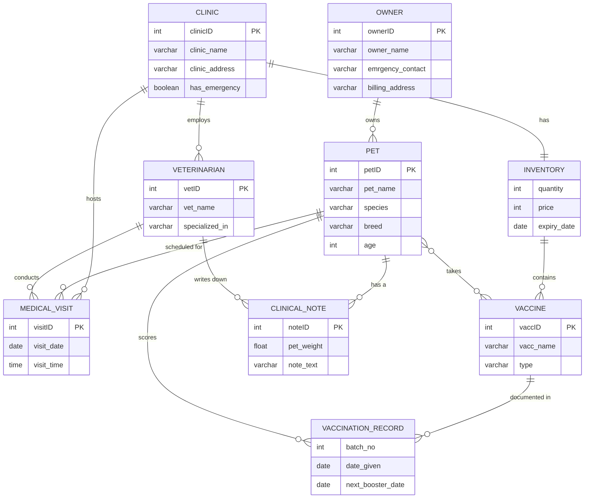

# 🐾 VetClinic: Full Database Project

A veterinary clinic management database, built end to end: conceptual modeling in **PowerDesigner**, a physical schema in **SQL Server**, and a **C# Windows Forms** desktop application that talks to the database through **ADO.NET**.

Developed as a university database systems project (May 2026) at the Faculty of Computer Science and Artificial Intelligence, Cairo University.

---

## 📑 Table of Contents

1. [Overview](#-overview)
2. [Tech Stack](#-tech-stack)
3. [System Architecture](#-system-architecture)
4. [Entity Relationship Diagram](#-entity-relationship-diagram)
5. [Entities and Attributes](#-entities-and-attributes)
6. [Relationships](#-relationships)
7. [Design Decisions](#-design-decisions)
8. [Desktop Application](#-desktop-application)
9. [Getting Started](#-getting-started)
10. [What I Learned](#-what-i-learned)
11. [Future Improvements](#-future-improvements)
12. [Author](#-author)

---

## 📖 Overview

A veterinary clinic juggles many connected pieces of information: the clinics themselves, their veterinarians, the pets and their owners, medical visits, clinical notes, and vaccinations. This project models all of that in a relational database so that the data is stored once, stays consistent, and can be queried reliably.

The project covers the **full database development lifecycle**:

- **Conceptual and logical design:** ER modeling in PowerDesigner
- **Physical implementation:** SQL Server DDL (tables, keys, constraints)
- **Data population:** sample data for testing and demonstration
- **Application layer:** a C# Windows Forms app using ADO.NET

The model has **9 entities** and **11 relationships**, with a strong focus on **vaccination tracking**: which vaccines a clinic stocks, which vaccines each pet has received, and when the next booster is due.

---

## 🛠 Tech Stack

| Layer | Technology |
|---|---|
| Data modeling | SAP PowerDesigner |
| Database | Microsoft SQL Server |
| Query language | T-SQL |
| Application | C# with Windows Forms (.NET) |
| Data access | ADO.NET |

---

## 🏗 System Architecture

```
┌─────────────────────────┐
│  C# Windows Forms UI    │
└───────────┬─────────────┘
            │  ADO.NET (SqlConnection, SqlCommand, SqlDataAdapter)
┌───────────▼─────────────┐
│       SQL Server        │
└─────────────────────────┘
```

The UI does not store data itself. Every form reads from and writes to SQL Server through ADO.NET, so the database is the single source of truth.

---

## 🗺 Entity Relationship Diagram



---

## 🗃 Entities and Attributes

### Clinic
A clinic location of the veterinary practice.

| Attribute | Type | Notes |
|---|---|---|
| clinicID | Integer | Primary key |
| clinic_name | Variable characters (50) | |
| clinic_address | Variable characters (50) | |
| has_emergency | Boolean | Whether the clinic offers emergency care |

### Inventory
The stock held by a clinic. Each clinic has exactly one inventory, and the inventory is identified through its clinic.

| Attribute | Type |
|---|---|
| quantity | Integer |
| price | Integer |
| expiry_date | Date |

### Veterinarian

| Attribute | Type | Notes |
|---|---|---|
| vetID | Integer | Primary key |
| vet_name | Variable characters (50) | |
| specialized_in | Variable characters (50) | Area of specialty |

### Vaccine
A vaccine type stocked in an inventory.

| Attribute | Type | Notes |
|---|---|---|
| vaccID | Integer | Primary key |
| vacc_name | Variable characters (50) | |
| type | Variable characters (50) | |

### Vaccination Record
Documents one vaccine given to one pet.

| Attribute | Type | Notes |
|---|---|---|
| batch_no | Integer | Batch number of the vaccine dose |
| date_given | Date | |
| next_booster_date | Date | When the next booster is due |

### Medical Visit

| Attribute | Type | Notes |
|---|---|---|
| visitID | Integer | Primary key |
| visit_date | Date | |
| visit_time | Time | |

### Pet

| Attribute | Type | Notes |
|---|---|---|
| petID | Integer | Primary key |
| pet_name | Variable characters (50) | |
| species | Variable characters (20) | |
| breed | Variable characters (20) | |
| age | Integer | |

### Owner

| Attribute | Type | Notes |
|---|---|---|
| ownerID | Integer | Primary key |
| owner_name | Variable characters (50) | |
| emrgency_contact | Variable characters (50) | Emergency contact for the owner |
| billing_address | Variable characters (50) | |

### Clinical Note

| Attribute | Type | Notes |
|---|---|---|
| noteID | Integer | Primary key |
| pet_weight | Float | Weight recorded when the note was written |
| note_text | Variable characters (500) | |

---

## 🔗 Relationships

| From Entity | Relationship | To Entity | Cardinality | Description |
|---|---|---|---|---|
| Clinic | has | Inventory | One-to-one | Each clinic has exactly one inventory; each inventory belongs to exactly one clinic |
| Clinic | hosts | Medical Visit | One-to-many | A clinic hosts many medical visits; each visit takes place at one clinic |
| Clinic | employs | Veterinarian | One-to-many | A clinic employs many veterinarians; each vet works at one clinic |
| Inventory | contains | Vaccine | One-to-many | An inventory stocks many vaccine types; each vaccine type is stocked in one inventory |
| Vaccine | documented in | Vaccination Record | One-to-many | A vaccine is documented in many records; each record documents one vaccine |
| Medical Visit | scheduled for | Pet | One-to-many | A pet has many medical visits; each visit is scheduled for one pet |
| Pet | scores | Vaccination Record | One-to-many | A pet has many records over its lifetime; each record belongs to one pet |
| Pet | takes | Vaccine | Many-to-many | A pet receives many vaccines over its lifetime; a vaccine type is taken by many pets |
| Pet | has a | Clinical Note | One-to-many | A pet has many clinical notes through visits; each note is written for one pet |
| Owner | owns | Pet | One-to-many | An owner can own many pets; each pet belongs to one owner |
| Veterinarian | writes down | Clinical Note | One-to-many | A vet writes many clinical notes; each note is written by one vet |
| Veterinarian | conducts | Medical Visit | One-to-many | A vet conducts many visits; each visit is conducted by one vet |

---

## 🧠 Design Decisions

- **Vaccination Record resolves the many-to-many.** A pet can take many vaccines and a vaccine is taken by many pets, so the *Vaccination Record* entity sits between them. It carries the details of each dose (batch number, date given, and next booster date), which a plain link between Pet and Vaccine could not hold.
- **Booster tracking is built in.** Storing `next_booster_date` on each record lets the clinic see which pets are due for a booster.
- **Inventory is tied one-to-one to a clinic.** Stock, price, and expiry belong to a specific clinic, and vaccine types are stocked through that inventory.
- **Clear ownership of work.** Visits and clinical notes are linked to both the pet and the veterinarian, so every piece of medical history has a pet, a vet, and a clinic behind it.
- **Owners are separate from pets.** One owner can have many pets without repeating the owner's name, emergency contact, or billing address.

---

## 💻 Desktop Application

A Windows Forms application built in C# provides a user interface over the database.

- Connects to SQL Server through `SqlConnection`
- Runs queries and commands with `SqlCommand`
- Fills grids and forms using `SqlDataAdapter` and `DataTable`
- Displays results in `DataGridView` controls

---

## 🚀 Getting Started

### Prerequisites
- Windows
- Microsoft SQL Server and SQL Server Management Studio (SSMS)
- Visual Studio with the **.NET desktop development** workload

### Setup

1. **Clone the repository** and open the project folder.
2. **Create the database.** In SSMS, run the table creation script first, then the sample data script.
3. **Configure the connection string.** In the C# project, set the server name to your own SQL Server instance (for example, `localhost` or `.\SQLEXPRESS`) and use Windows Authentication.
4. **Run the app.** Open the `.sln` file in Visual Studio, build the solution, and press **F5**.

### Troubleshooting
- **Cannot connect to the server:** check the server name in the connection string and make sure the SQL Server service is running.
- **Login failed:** confirm Windows Authentication is enabled, or switch to a SQL login.
- **Empty grids:** make sure the sample data script ran successfully.

---

## 🎓 What I Learned

- Turning requirements into an ER model, then into a relational schema
- Resolving a many-to-many relationship with an associative entity
- Using PowerDesigner to move from conceptual to physical design
- Writing SQL Server DDL with proper keys and constraints
- Connecting a desktop application to a database with ADO.NET

---

## 🔮 Future Improvements

- Add user roles and login (admin, vet, receptionist)
- Add automatic reminders for upcoming booster dates
- Add billing and invoices linked to visits
- Build a Power BI dashboard on top of the database
- Move data access to stored procedures for better security and reuse

---

## 👤 Authors

Computer Science and AI students, Cairo University (FCAI)
**Seif Hussein Aboelazaim**
**Mohamed Hany**
**Mohamed Nabil**
**Youssef Mohamed**
**Anas elsisi**
**Khaled Mohamed**


- LinkedIn: [linkedin.com/in/seifaboelazaim](https://linkedin.com/in/seifaboelazaim)
- Email: seifhuss74@gmail.com
